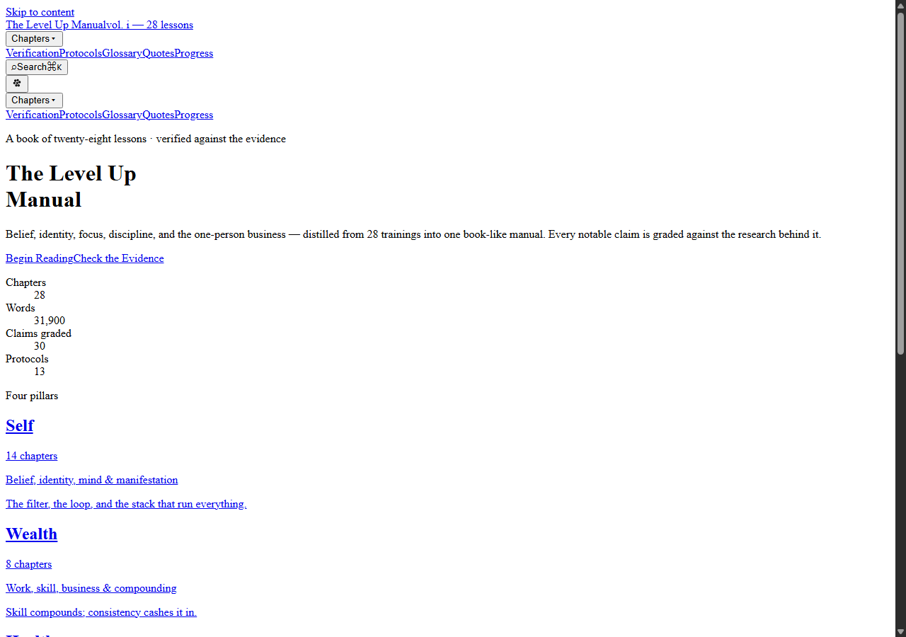

# Level Up

Level Up is a website I made to turn a long self-improvement video into something I could actually use instead of just watching once and forgetting.

**Live site:** https://hustlenix.github.io/LevelUp/

## Description

The project started with a roughly 20-hour self-development video. I went through the material and turned it into 28 readable chapters, then kept adding tools that made the information more useful in day-to-day life.

You can read the chapters, search through them, take quizzes, save highlights, track progress, use focus sessions, set goals, review your work, and use the built-in Study Mode.

I also added a small companion called **Milo**. Milo is connected to the things you actually do in Level Up. For example, completing focus sessions, reading chapters, or reaching milestones can change what Milo is doing and unlock things in his room.

Most of the app works locally in your browser. You do not need to create an account just to use the main features.

If you only want to see the Milo system quickly, there is a reviewer demo here:

https://hustlenix.github.io/LevelUp/today/?milo=demo

### Screenshots



## Main Features

- 28 self-improvement chapters
- chapter search
- quizzes and reflections
- highlights and bookmarks
- progress tracking
- goals and roadmaps
- focus sessions
- daily and weekly reviews
- Study Mode
- streaks, XP and badges
- local backup and restore
- Milo, the persistent companion
- GitHub Pages deployment

## Getting Started

### Dependencies

To run Level Up locally you will need:

- Node.js
- npm
- Git

The project uses Next.js, React, TypeScript and Tailwind CSS.

### Installing

Clone the repository:

```bash
git clone https://github.com/Hustlenix/LevelUp.git
cd LevelUp
```

Install the dependencies:

```bash
npm install
```

### Executing program

Start the development server:

```bash
npm run dev
```

Then open:

```text
http://localhost:3000
```

To make a production build:

```bash
npm run build
npm start
```

## Testing

Before I ship changes I normally run:

```bash
npm run lint
npm test
npm run build
```

There are also Playwright checks for the deployed site.

```bash
npx playwright install chromium
PLAYWRIGHT_BASE_URL=https://hustlenix.github.io/LevelUp node verify-release.mjs
```

## Help

If the project does not start, first make sure the dependencies installed correctly:

```bash
npm install
```

If the local build looks different from the GitHub Pages version, remember that the deployed site uses the case-sensitive base path:

```text
/LevelUp
```

You can also check the repository's GitHub Actions runs if the public site did not deploy after a push.

## Why I Made This

I originally wanted a better way to learn from one very long video without constantly scrubbing through it again.

Once the reading version worked, I started experimenting with ways to make the project more useful: progress tracking, study tools, focus sessions, goals, and eventually Milo.

The project has changed a lot from the first version, but the main idea is still the same: make useful information easier to come back to and actually apply.

## License

The written site content is licensed under the **Creative Commons Attribution-NonCommercial 4.0 International License (CC BY-NC 4.0)**.

See the [LICENSE](LICENSE) file for the full details.

The source code is not included under that content license unless explicitly stated.
