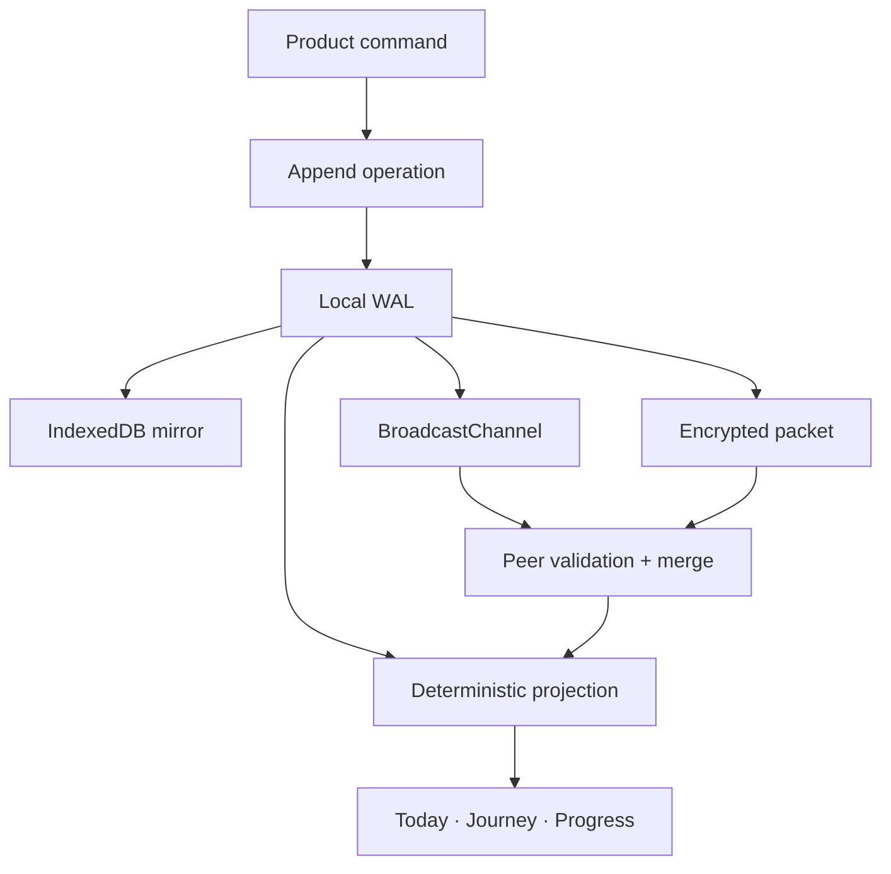

# LevelUp Nexus Protocol

Status: implemented protocol v1  
Schema: v1  
Primary code: `lib/nexus/`  
Interactive inspector: `/sync-lab/`

Nexus is the local-first replication layer behind LevelUp's profile, preferences, and real-world mission completions. It was built to solve a product problem: progress must remain usable offline and must not be double-counted when the same history is replayed, restored, or moved between devices.

This is not a simulated architecture page. Today, onboarding, mission completion, XP, skill XP, streaks, Profile, Backup, and the Sync Lab all read the materialized state produced by this protocol.

## Guarantees

For a valid workspace, Nexus aims to provide these properties:

1. **Offline writes:** a replica can append progress without network access.
2. **Replay safety:** importing the same operation repeatedly does not award XP repeatedly.
3. **Deterministic convergence:** replicas with the same valid operation set produce the same profile, preferences, completions, XP, skills, and streaks regardless of delivery order.
4. **Causal evidence:** each actor has a monotonically increasing sequence and a per-actor hash chain.
5. **Fail-closed ingestion:** malformed operations, invalid digests, sequence gaps, workspace mismatches, and observable actor forks are rejected before projection.
6. **Bounded storage:** a verified operation prefix can be folded into a checkpoint without changing materialized progress.
7. **Portable confidentiality:** manual device-transfer packets are encrypted and authenticated in the browser.
8. **Progressive migration:** the former `LifeState` snapshot is migrated on first use and remains as a compatibility view for old backups.

Nexus does **not** claim Byzantine consensus, server durability, account recovery, background cross-device delivery, or protection from someone who has both the encrypted file and its passphrase. Those are explicit non-goals for the static GitHub Pages deployment.

## Architecture



The synchronous browser write path is deliberately small:

1. refresh from the local write-ahead log;
2. append one immutable operation;
3. recompute the materialized `LifeState`;
4. commit replica and compatibility view to `localStorage`;
5. mirror to IndexedDB;
6. announce an envelope to other open tabs.

The UI never increments XP directly. XP and skill XP are sums over the winning mission-completion records in the projection.

## Replica model

A replica contains:

| Field | Purpose |
| --- | --- |
| `workspaceId` | Prevents unrelated users or resets from merging |
| `replicaId` | Identifies the current writer/actor |
| `nextSequence` | Next actor-local operation number |
| `clock` | Hybrid logical clock for deterministic register ordering |
| `operations` | Retained immutable suffix after the checkpoint |
| `checkpoint` | Optional compacted projection, frontier, and actor heads |
| `createdAt` / `updatedAt` | Replica metadata; not used to resolve domain state |

Each browser document receives a fresh actor identity. This avoids two tabs racing on the same actor sequence. The full workspace log is retained and merged across those actor identities.

An operation contains its schema, stable ID (`actor:sequence`), workspace, actor, sequence, hybrid clock, dependency vector, domain kind, entity ID, payload, previous actor digest, and its own digest.

Supported protocol-v1 operations are intentionally narrow:

- `profile.set`
- `preferences.patch`
- `mission.complete`

Adding a new operation requires a payload validator, projection rule, convergence test, backup support when relevant, and a protocol-version decision.

## Logical time

Wall clocks can move backward or disagree between devices. Nexus therefore uses a hybrid logical clock (HLC):

```text
(wallTime, logicalCounter, actorId)
```

On a local write, `wallTime` is the maximum of the prior HLC and the observed wall clock. If it does not advance, the logical counter increments. Actor ID provides a stable final tie-break. A unit test covers the backward-clock case.

Domain `updatedAt` is derived from winning operation clocks rather than envelope arrival time. This is important: two replicas that receive the same events in different orders must not disagree because one received its last envelope a millisecond later.

## Version vectors and merge

The frontier is a version vector mapping every known actor to its highest contiguous sequence.

Envelope merge proceeds as follows:

1. validate envelope schema and deterministic digest;
2. require the same workspace, except when adopting into a completely empty replica;
3. validate and merge checkpoints;
4. sort incoming operations by actor and sequence;
5. reject invalid payloads or operation digests;
6. de-duplicate known `actor:sequence` IDs;
7. require the next contiguous sequence for each actor;
8. require `previousDigest` to match that actor's current head;
9. append accepted operations and observe their clocks;
10. materialize the projection.

Retries are harmless. A repeated operation is counted as a duplicate. The same ID with a different digest is an actor fork and is rejected.

## Projection and conflict rules

Projection is a small CRDT-style state machine:

| Domain value | Merge rule | Product consequence |
| --- | --- | --- |
| Profile | Last-writer-wins register by HLC, then operation ID | Concurrent profile edits resolve identically |
| Preference key | Independent last-writer-wins register | Changing sound does not overwrite motion settings |
| Mission completion | Map keyed by `missionId`, winner by HLC | The same mission produces XP once |

Mission completion is not a counter increment. It is a fact with a stable identity. Total XP, skill XP, completion count, and streak history are derived from the set of winning facts. That is the mechanism that prevents a retry or repeated import from manufacturing progress.

This design favors deterministic convergence over preserving two contradictory proofs for the same mission ID. The losing proof is still present in the uncompacted operation log until compaction, but it does not affect the product projection.

## Integrity and checkpoints

Protocol-v1 operation, checkpoint, envelope, and replica digests use SHA-256 over canonical JSON. This catches mutation and makes hash-chain behavior inspectable; it is still not a digital signature, because a party allowed to author an envelope can compute a new digest.

Every actor operation includes the previous operation's digest. Audit verifies:

- schema and protocol version;
- operation digests;
- unique operation IDs;
- contiguous per-actor sequences;
- per-actor previous-digest links;
- checkpoint digest and shape.

A checkpoint contains:

- the materialized projection;
- the version-vector frontier;
- the current digest head for every actor;
- a creation time and checkpoint digest.

Compaction replaces the verified retained prefix with this checkpoint. Late replicas can receive the checkpoint plus newer operations. The live store checkpoints automatically after 512 retained operations; Sync Lab also exposes the operation manually. A peer cannot reconstruct compacted individual operations; this is why the UI asks before manual compaction.

## Browser durability and transport

Nexus uses two browser stores with different roles:

- **localStorage:** synchronous write-ahead log used for command durability and `storage`-event fallback;
- **IndexedDB:** asynchronous strict-durability mirror used to recover when the write-ahead copy is missing.

Open tabs exchange full, idempotent envelopes through `BroadcastChannel`. Before appending locally, a tab refreshes from the write-ahead copy. Each document uses a distinct actor, so simultaneous writes do not claim the same sequence. Eventual tab messages converge a last-writer storage race.

The deployed app has no hidden cloud service. Cross-device exchange is explicit: export a `.nexus` packet and import it into a replica in the same workspace (or into a fresh install).

## Encrypted transfer format

Encrypted packets use browser Web Crypto only:

- KDF: PBKDF2-HMAC-SHA-256
- production cost: 210,000 iterations
- random salt: 16 bytes
- cipher: AES-GCM-256
- random IV: 12 bytes
- authentication tag: 128 bits
- authenticated metadata: packet version, room ID, creation time

The room ID is a short checksum used to detect a payload/metadata mismatch; it is not a secret. The passphrase is normalized in memory, is never stored, and is never added to analytics. AES-GCM authentication fails if the password, ciphertext, IV, or authenticated metadata is wrong.

The ordinary full-backup JSON is intentionally separate and unencrypted. It now contains the Nexus replica so a restore preserves operation provenance. Users who need confidentiality should use the encrypted Nexus transfer or protect the backup file themselves.

## Failure behavior

| Failure | Behavior |
| --- | --- |
| Offline | Local commands continue; transport catches up later |
| Duplicate packet | Zero new operations; progress unchanged |
| Wrong passphrase | AES-GCM decrypt fails; nothing is merged |
| Changed ciphertext | Authentication fails; nothing is merged |
| Changed operation | Operation digest fails; operation rejected |
| Missing actor sequence | Gap rejected |
| Same actor/sequence, different digest | Fork rejected |
| Different workspace | Merge rejected unless local replica is empty |
| Damaged write-ahead copy | Valid legacy view or IndexedDB mirror can recover |
| Unsupported schema | Validation fails rather than guessing a migration |

## Verification

`tests/nexus.test.mjs` covers:

- convergence after a partition;
- delivery-order independence;
- replay and duplicate safety;
- tamper rejection;
- sequence-gap rejection;
- actor-fork rejection;
- checkpoint state preservation;
- late-replica catch-up;
- encryption round-trip, wrong password, and ciphertext tampering;
- HLC monotonicity under backward wall-clock movement;
- deterministic replay of a 500-operation log.

`verify-release.mjs` also drives the browser Sync Lab: it creates writes on two partitioned nodes, checks that they diverge, reconnects them, checks convergence, and downloads a real encrypted packet. The same release test checks mission XP and full-backup restoration.

## Known limitations and next protocol work

The current protocol is designed for an account-free static application. The most valuable future work would be:

1. an optional opaque relay that stores only encrypted envelopes;
2. device-key signatures and explicit device revocation;
3. checkpoint ancestry proofs for stronger fork detection across independently compacted descendants;
4. quota-pressure telemetry that never exposes mission content;
5. protocol migration fixtures when a v2 operation is introduced.

Those are not represented as finished features in the UI. The current boundary is deliberately visible and testable.
